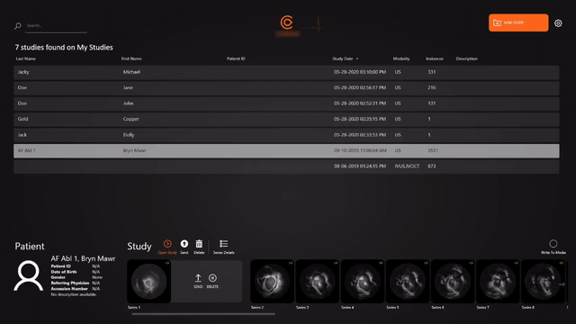
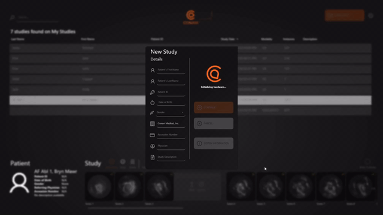
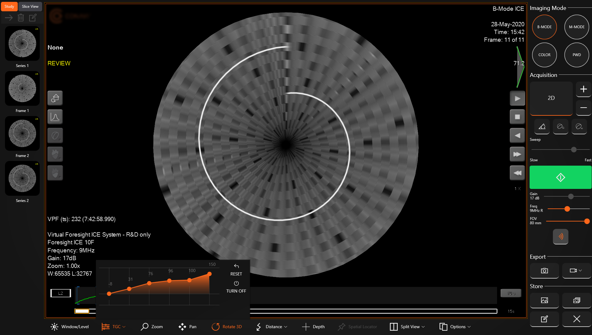

# Company User Interface

## Introduction
This project is a user interface (UI) that was designed and developed for a biomedical company focused on imaging. Every component is functional and was designed with the help of project managers, marketing teams, and physcians. The UI was designed and programmed by me over a span of 6 months, with the goal of catering physians during active surgery. The only component that was not a redesign was the image viewer that displays the medical images in the middle.

## Technologies Used
  - C#
  - XAML
  - Windows Presentation Foundation (WPF)
  - Visual Studio 2017

## Screenshots

### Home

### New Study

### Image Viewer Type I

### Image Viewer Type 2

### Activity Monitor

